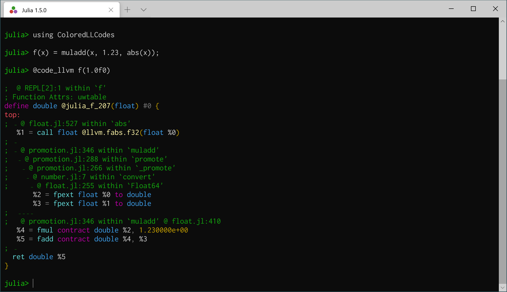
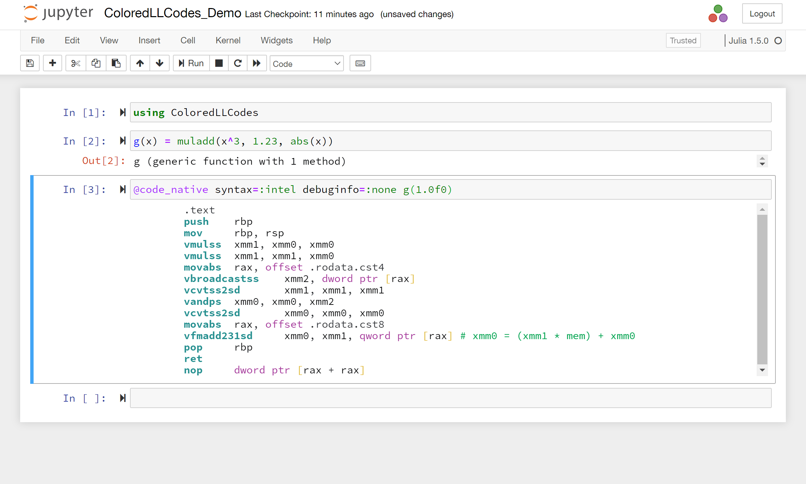

# ColoredLLCodes
[![Build Status][action-img]][action-url]
[![Build Status][pkgeval-img]][pkgeval-url]
[![coverage][codecov-img]][codecov-url]

The feature of this package has been incorporated into `InteractiveUtils`
of Julia v1.6. You can use this package to enable syntax highlighting of
`code_llvm` and `code_native`, even on Julia v1.5 or earlier.

## Screenshots





## Installation
```julia
julia> import Pkg; Pkg.add("ColoredLLCodes")
```
or
```julia
pkg> add ColoredLLCodes
```

## Customizing colorscheme
You can customize the printing styles by overwriting the dictionary
`ColoredLLCodes.llstyle`. Each style is specified by a tuple of the bold flag
and the color keyword or ANSI color code (0-255).
For example:
```julia
# Monokai256
ColoredLLCodes.llstyle[:default]     = (false, :normal)
ColoredLLCodes.llstyle[:comment]     = (false, 101)
ColoredLLCodes.llstyle[:label]       = (false, :normal)
ColoredLLCodes.llstyle[:instruction] = ( true, 197)
ColoredLLCodes.llstyle[:type]        = (false, 81)
ColoredLLCodes.llstyle[:number]      = (false, 141)
ColoredLLCodes.llstyle[:bracket]     = (false, :normal)
ColoredLLCodes.llstyle[:variable]    = (false, 208)
ColoredLLCodes.llstyle[:keyword]     = (false, 197)
ColoredLLCodes.llstyle[:funcname]    = (false, 208)
```
```julia
# Classic (used in the screenshots above)
ColoredLLCodes.llstyle[:default]     = (false, :light_black)
ColoredLLCodes.llstyle[:comment]     = (false, :green)
ColoredLLCodes.llstyle[:label]       = (false, :light_red)
ColoredLLCodes.llstyle[:instruction] = ( true, :light_cyan)
ColoredLLCodes.llstyle[:type]        = (false, :cyan)
ColoredLLCodes.llstyle[:number]      = (false, :yellow)
ColoredLLCodes.llstyle[:bracket]     = (false, :yellow)
ColoredLLCodes.llstyle[:variable]    = (false, :normal)
ColoredLLCodes.llstyle[:keyword]     = (false, :light_magenta)
ColoredLLCodes.llstyle[:funcname]    = (false, :light_yellow)
```

[action-img]: https://github.com/kimikage/ColoredLLCodes.jl/workflows/CI/badge.svg
[action-url]: https://github.com/kimikage/ColoredLLCodes.jl/actions

[pkgeval-img]: https://juliaci.github.io/NanosoldierReports/pkgeval_badges/C/ColoredLLCodes.svg
[pkgeval-url]: https://juliaci.github.io/NanosoldierReports/pkgeval_badges/report.html

[codecov-img]: https://codecov.io/gh/kimikage/ColoredLLCodes.jl/branch/master/graph/badge.svg
[codecov-url]: https://codecov.io/gh/kimikage/ColoredLLCodes.jl
